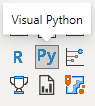

# PYWERBI
Scripts gráficos do Python no Power BI

# Como Criar gráficos do python no Power BI

as vezes os gráficos do power bi não apresentam um grau de personalização satisfatório, e recorremos a soluções não convencionais, assim os gráficos do python são altamente personalizáveis, um exemplo que tive que lidar foi inserir uma linha de corte para vizualizar mais facilmente os outliers em um gráfico de disperção isso com o setup padão do power bi não é possível usando as configurações padrão do visual, mas, no python é possível, assim podemos usar os gráficos do python para preencher este gap.

Criação de um Dashboard Simples com Power BI, utilizando um dos gráficos criados no python para uma maior personalização e uso de elementos não presentes nos gráficos padrão do Power BI. 

## Tecnologia

Os softwares  usados neste projeto foram:

* Microsoft Power BI
* Anconda
* Pycharm

## Serviços Usados

* Github
* Google Colab

## Como foi feito

Será descrito abaixo através de textos e imagens.

Infelizmente o jeito mais fácil de integrar os dois é utilizando a distribuição Anacoda do python:

https://www.anaconda.com/

Pois o pip install não pode ser incluido no script no power bi por vias normais, então as bibliotecas precisam ser pré-instaladas, 
assim pode ser utilizado outra metodologia, mas a mais simples seria usar esta distribuição e alterar o path no power bi.

Faça o download e instale de forma padrão.

Agora no Power BI vamos na aba configurações

Arquivo>Opções e Configurações>Opçoes>Scripts do Python
  
verificamos se o caminho está como a distribuição do anaconda.
  

## Solução Alternativa
Em meu equipamento o anaconda não instalou corretamente devido as limitações de hardware, assim usei o pycharm para pré instalar as bibliotécas no pyhton padrão.
primeiro instale o pycharm e abra as configurações.
selecione a ditribuição padrão e intale todas as bibliotecas desejadas.
ao final devem aparecer as bibliotecas intaladas.

 
 
 Agora vamos alterar o caminho no power bi para a distribuição padão do pyhton.
 
 
 
 ambiente configurado vamos carregar uns dados...
 
 eu utilizei dados desta fonte: https://github.com/microsoft/powerbi-desktop-samples/blob/main/AdventureWorks%20Sales%20Sample/AdventureWorks%20Sales.xlsx
  
  
 
 após carregar os dados podemos começar a construir nosso dashboard.
 
 
 

Fiz um teste e usei o script abaixo para gerar um gráfico de histograma bem simples só para testar se as configurações foram feitas corretamente.

import matplotlib.pyplot as plt
  
plt.hist(dataset['Sales Amount'])
  
plt.show()

Tivemos um problema com a data pois estava em um formato que o power bi não conseguia ler assim aplicamos uma linha calculada com um código de manupulação de texto para tranformar a coluna em uma coluna de data usamdo o código abaixo:
  
Order_date = concatenate(left(right(Sales[OrderDateKey],4),2),concatenate("-",concatenate(right(Sales[OrderDateKey],2),concatenate("-",left(Sales[OrderDateKey],4)))))  
a data estava no formato 20170714
  
assim inserimos separadores ficando com o texto 2017-07-14
Agora inserimos nosso script principal um gráfico de dispersão com uma linha indicando os outliers,
  

  
Usamos o script abaixo para criar o gráfico de disperção com linha de outliers:
  
import seaborn as sns
  
import matplotlib.pyplot as plt
  
import pandas as pd
  
import numpy as np
  
Q1 = np.quantile(dataset['Sales Amount'], 0.25)
  
Q2 = np.quantile(dataset['Sales Amount'], 0.5)
  
Q3 = np.quantile(dataset['Sales Amount'], 0.75)
  
lower_limit = Q1 - (1.5 * (Q3-Q1))
  
upper_limit = Q3 + (1.5 * (Q3-Q1))
  
dataset['Mes_Ano'] = (dataset['Mês'].astype(str)+"-"+dataset['Ano'].astype(str))
  
plt.figure(figsize=(9,9))
  
sns.scatterplot(data=dataset,x=dataset['Mes_Ano'],y=dataset['Sales Amount'])
  
plt.axhline(y=upper_limit)
  
locs, labels = plt.xticks()
  
plt.setp(labels, rotation=45)
  
plt.show()  

finalmente temos nosso gráfico.
 
## Recursos Usados

  - Importação de dados
  - Crianção de uma coluna calculada com DAX
  - Criação de um visual com script em python
  
  

## Links

  - Repositório: https://github.com/Alexandremsn/PYWERBI
  - Se for encontrado um bug, favor entrar em contato alexandremsneto1986@gmail.com

## Versão

1.0.0.0

## Autor

* **Alexandre Machado da Silva Neto**: @alexandremsn (https://github.com/alexandremsn)
